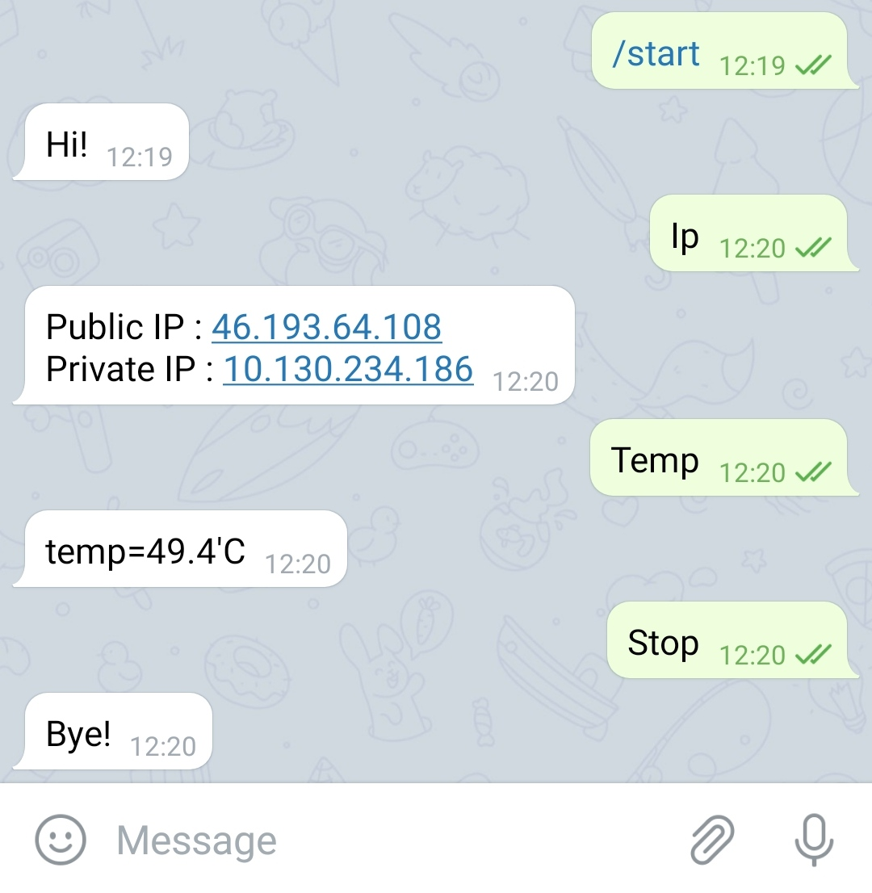

<!DOCTYPE html>
<html>

<head>
  <meta charset="utf-8">
  <meta name="viewport" content="width=device-width, initial-scale=1.0">
  <link rel="stylesheet" href="https://stackedit.io/style.css" />
</head>

<body class="stackedit">
  
<h1 id="bot-telegram-raspberry">Bot-Telegram-Raspberry</h1>
<h1 id="fonctionnalités">Fonctionnalités</h1>
<ul>
<li>Interagir avec son Raspberry Pi à distance et facilement avec l’application Telegram</li>
<li>Obtenir des informations à travers Telegram comme l’adresse IP publique du Raspberry Pi afin d’établir des connexions (SSH, FTP, HTTPS) à distance</li>
<li>Utilisation de python, de l’API Telegram et de l’API OpenWeatherMap pour la météo</li>
</ul>
<h1 id="installation">Installation</h1>

Vous devez installer l’API pour communiquer avec Telegram :

<code>$ pip install python-telegram-bot</code>

Vous devez aussi créer votre BOT avec <code>BotFather</code> sur Telegram afin d’obtenir la clé d’API à renseigner dans le script

<h1 id="utilisation">Utilisation</h1>

Pour que le script soit lancé dès le demarage du Raspberry Pi :

<pre><code>sudo nano /etc/rc.local
</code></pre>

puis cette ligne à ajouter : <code>python "chemin du Bot-telegram.py" &amp;</code>

<h1 id="présentation">Présentation</h1>

Cet exemple a été fait sur l’application Telegram :

   

</body>

</html>
